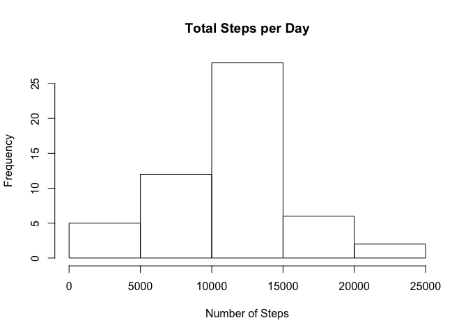
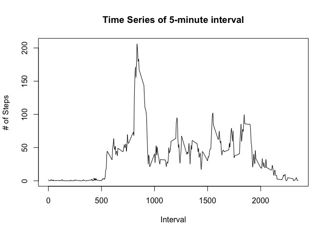
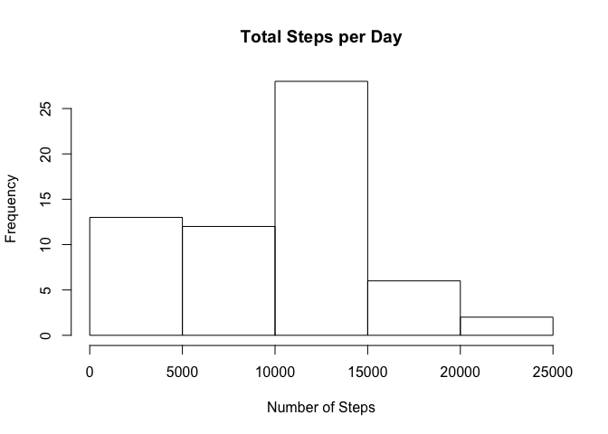
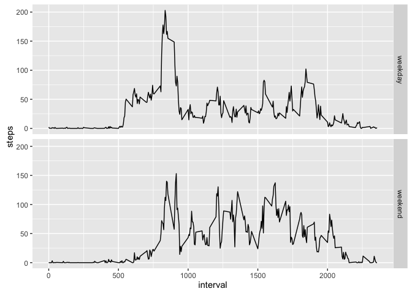

# Reproducible Research: Peer Assessment 1

Setting up directory. The file used in this document can be downloaded at <https://github.com/rdpeng/RepData_PeerAssessment1/blob/master/activity.zip>

```r
knitr::opts_knit$set(root.dir = '~/Documents/datasciencecoursera')
```
## Loading and preprocessing the data


```r
data <- read.table("activity.csv",
                   sep = ",",
                   header = TRUE, 
                   na.strings ="NA", 
                   colClasses = c('integer','Date','factor'))
```

## What is mean total number of steps taken per day?

_Calculate the total number of steps taken per day_


```r
stepsSum <- aggregate(as.numeric(as.character(steps)) ~ date, data=data, sum)
```

_Make a histogram of the total number of steps taken each day_


```r
colnames(stepsSum) <- c("Date", "Steps")

hist(stepsSum$Steps, xlab = "Number of Steps", main = "Total Steps per Day")
```

<!-- -->

_Calculate and report the mean and median of the total number of steps taken per day_


```r
mean(stepsSum$Steps)
```

```
## [1] 10766.19
```


```r
median(stepsSum$Steps)
```

```
## [1] 10765
```

## What is the average daily activity pattern?
_Make a time series plot (i.e. type = "l") of the 5-minute interval (x-axis) and the average number of steps taken, averaged across all days (y-axis)_


```r
aggInterval <- aggregate(as.numeric(as.character(steps)) ~ as.numeric(as.character(interval)), 
                         data=data, 
                         mean)

colnames(aggInterval) <- c("interval", "steps")

plot(aggInterval, 
     type="l", 
     xlab="Interval", 
     ylab="# of Steps", 
     main="Time Series of 5-minute interval")
```

<!-- -->

_Which 5-minute interval, on average across all the days in the dataset, contains the maximum number of steps?_

Interval:

```r
max(aggInterval$interval)
```

```
## [1] 2355
```

## Imputing missing values

_Calculate and report the total number of missing values in the dataset (i.e. the total number of rows with NAs)_

The data summary shows the number of NAs:

```r
summary(data)
```

```
##      steps             date               interval    
##  Min.   :  0.00   Min.   :2012-10-01   0      :   61  
##  1st Qu.:  0.00   1st Qu.:2012-10-16   10     :   61  
##  Median :  0.00   Median :2012-10-31   100    :   61  
##  Mean   : 37.38   Mean   :2012-10-31   1000   :   61  
##  3rd Qu.: 12.00   3rd Qu.:2012-11-15   1005   :   61  
##  Max.   :806.00   Max.   :2012-11-30   1010   :   61  
##  NA's   :2304                          (Other):17202
```

There are 2304 NAs

_Devise a strategy for filling in all of the missing values in the dataset._


```r
copy <- read.table('activity.csv',
                   sep = ",",
                   header = TRUE, 
                   na.strings ="NA", 
                   colClasses = c('integer','Date','factor'))
```

I decided to use the mean for a day in case of NAs. If the mean still produces NAs I decided to introduce 0s.

_Create a new dataset that is equal to the original dataset but with the missing data filled in._


```r
for(i in 1:length(copy$steps)){ 
     if(is.na(copy[i,]$steps)) { 
         meanSteps <- mean(subset(copy, date == copy[i,]$date)$steps)
         if(is.na(meanSteps)) { 
             copy[i,]$steps = 0 }
            else {copy[i,]$steps = meanSteps } } }
```

_Make a histogram of the total number of steps taken each day and Calculate._


```r
stepsSumCopy <- aggregate(as.numeric(as.character(steps)) ~ date, data=copy, sum)
colnames(stepsSumCopy) <- c("Date", "Steps")
hist(stepsSumCopy$Steps, xlab = "Number of Steps", main = "Total Steps per Day")
```

<!-- -->

_Report the mean and median total number of steps taken per day._

```r
mean(stepsSumCopy$Steps)
```

```
## [1] 9354.23
```

```r
median(stepsSumCopy$Steps)
```

```
## [1] 10395
```

_Do these values differ from the estimates from the first part of the assignment? What is the impact of imputing missing data on the estimates of the total daily number of steps?_

The values differ from the first part of the aasignment. They are lower.

## Are there differences in activity patterns between weekdays and weekends?

_Create a new factor variable in the dataset with two levels – “weekday” and “weekend” indicating whether a given date is a weekday or weekend day._


```r
copy[,c("day")] <- "weekday"
for(i in 1:length(copy$steps)){ 
     if((weekdays(copy[i,]$date) == "Saturday") | (weekdays(copy[i,]$date) == "Sunday")) { 
         copy[i,]$day = "weekend" } }
```

_Make a panel plot containing a time series plot (i.e. type = "l") of the 5-minute interval (x-axis) and the average number of steps taken, averaged across all weekday days or weekend days (y-axis)._


```r
aggIntDay <- aggregate(as.numeric(as.character(steps)) ~ as.numeric(as.character(interval)) + day, 
                       data=copy, 
                       mean)
colnames(aggIntDay) <- c("interval","day","steps")
library(ggplot2)
p <- ggplot(aggIntDay, aes(interval, steps)) + geom_line()
p + facet_grid(day ~ .)
```

<!-- -->
